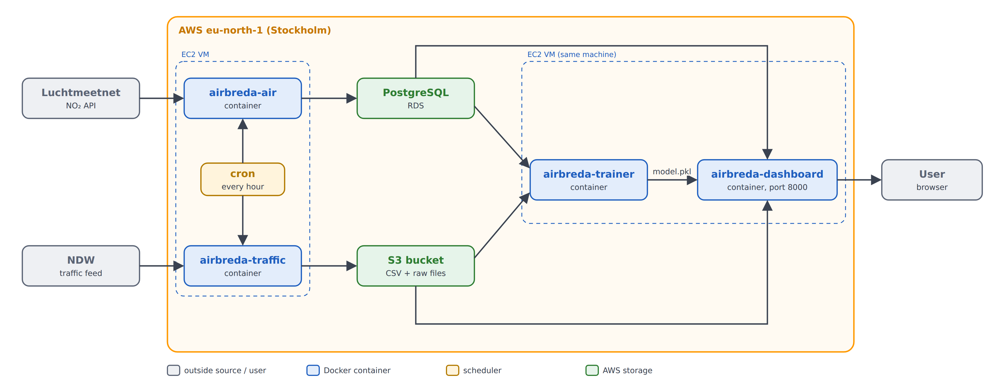

# AirBreda

Is traffic on the A27 near Breda linked to NO₂ (nitrogen dioxide) in the air? I built AirBreda to find out. Every hour it collects air-quality data from Luchtmeetnet and traffic data from NDW on AWS, and a live dashboard compares them using a linear regression.

- **Live dashboard:** http://16.171.236.39:8000 (port 8000 may be blocked on some campus networks; it works on mobile data)
- **API:** `/site/{site_id}` for `hrl`, `hrr`, `vwd`, `vwa`, and `/health`
- **Architecture Design Document:** [`docs/architecture.md`](docs/architecture.md)

Author: Michael Favour Eriabie (236474), BUas ADSAI Year 3, elective System Design & Cloud Platforms.

I set up the AWS account and every resource myself (EC2, RDS, S3, IAM, security groups), deployed the containers and ran the system. I used Claude as an assistant to explain concepts, review my code and help me write up; it had no access to my AWS account.

## How it works



A detailed version with every setting is in [`docs/airbreda_architecture.png`](docs/airbreda_architecture.png).

1. One EC2 t3.micro in eu-north-1 (Stockholm) runs everything in Docker.
2. Every hour at minute 0, cron starts two collectors:
   - `airbreda-air` (`ingest_air.py`): NO₂ from Luchtmeetnet station NL10240 into PostgreSQL on RDS. Duplicates are refused by the primary key (`ON CONFLICT DO NOTHING`). Null or stale values are kept with `is_flagged = TRUE`.
   - `airbreda-traffic` (`ingest_traffic.py`): the national NDW file, filtered to my four A27 sensors, saved to S3 as one CSV per sensor per hour plus the untouched raw file. Negative values (NDW's speed −1 means "no car measured") are dropped, logged and counted.
3. `airbreda-trainer` (run by hand) joins NO₂ and traffic per hour and fits a linear regression on total vehicles per hour and hour of day (UTC).
4. `airbreda-dashboard` (FastAPI, port 8000, `--restart unless-stopped`) reads both stores, applies the model, and serves the page and the API.

Each collector run writes one row to the `ingestion_runs` table; `/health` reads it back.

## Files

```
common.py               shared: JSON logging, database connection, run recording
ingest_air.py           collector 1: Luchtmeetnet NO₂ -> sensor_readings
ingest_traffic.py       collector 2: NDW traffic -> S3 (CSV per sensor + raw file)
storage.py              reads the traffic CSVs from S3 (or a local folder when testing)
build_training_data.py  joins NO₂ and traffic per hour -> out/training_data.csv
train_model.py          linear regression -> out/model.pkl + out/model_report.json
predict.py              predict(total_traffic, hour) -> predicted NO₂ + 0-1 risk
dashboard.py            the dashboard and API: /, /site/{id}, /health, /history
schema.sql              creates sensor_readings and ingestion_runs
Dockerfile              image airbreda-air
Dockerfile.traffic      image airbreda-traffic
Dockerfile.train        image airbreda-trainer
Dockerfile.dashboard    image airbreda-dashboard (model.pkl baked in)
requirements.txt        collectors
requirements-ml.txt     pinned versions shared by trainer and dashboard
docker-compose.yml      local testing only
docker-compose.day2.yml Day 2 lab: collectors + Redis queue (local only, not deployed)
DEPLOY.md               my deployment runbook
.env.example            template for the secrets file (.env is never committed)
tests/                  pytest: Day 1 filter, bad-data handlers, model
docs/                   Architecture Design Document (.md and PDF) and diagrams
```

## Run the tests

```bash
pip install -r requirements.txt -r requirements-ml.txt pytest
pytest -v
```

Database tests are skipped unless `TEST_DB_HOST` points at a test PostgreSQL.

## Deploy or update on the VM

See [`DEPLOY.md`](DEPLOY.md). To update the dashboard after a change:

```bash
cd ~/airbreda && git pull && docker rm -f dashboard && docker build -t airbreda-dashboard -f Dockerfile.dashboard . && docker run -d --name dashboard --restart unless-stopped --env-file .env -p 8000:8000 airbreda-dashboard
```

To retrain and redeploy:

```bash
docker run --rm --env-file .env -v /home/ec2-user/airbreda/out:/app/out airbreda-trainer && cp out/model.pkl . && docker rm -f dashboard && docker build -t airbreda-dashboard -f Dockerfile.dashboard . && docker run -d --name dashboard --restart unless-stopped --env-file .env -p 8000:8000 airbreda-dashboard && cat out/model_report.json
```

## Result so far

With 16 matched hours (final run, 2 October 2026), the model explains about 10% of the variation in NO₂ (R² 0.096, in-sample; adjusted R² is negative), and the traffic effect changed direction between runs. The pipeline works end to end, but I don't have enough data yet to say whether traffic drives NO₂. See ADR-006 in the design document.
