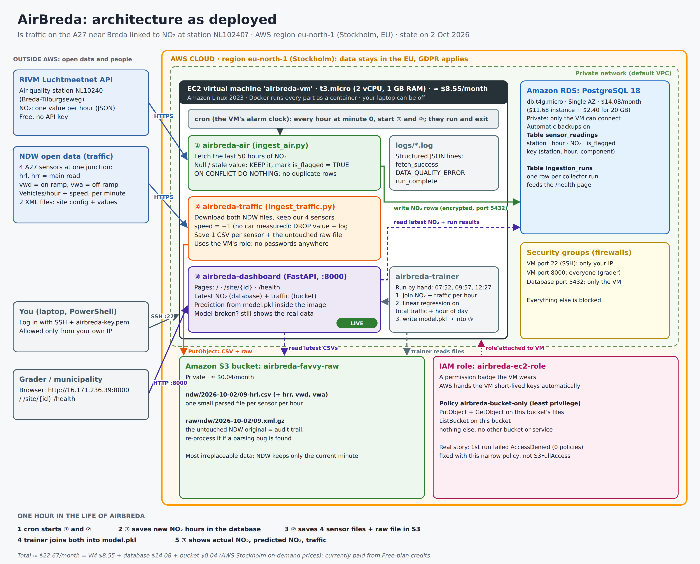

# AirBreda: Architecture Design Document

**Author:** Michael Favour Eriabie (236474), BUas ADSAI Year 3, elective System Design & Cloud Platforms
**System:** AirBreda, is traffic on the A27/Breda interchange associated with NO₂ at Luchtmeetnet station NL10240?
**Status of this document:** DRAFT. Sections marked ⚠️ CONFIRM need my check or real numbers from Friday's training run.

---

## 1. Architecture as deployed

*Figure 1. AirBreda as deployed on AWS eu-north-1 (Stockholm), 2 October 2026. Bottom strip: what happens in one hour.*

**Trust boundaries**

| Boundary | Who may cross it | How it is enforced |
|---|---|---|
| Internet → VM port 8000 | anyone (grader) | security group `launch-wizard-1`, 0.0.0.0/0 on 8000 |
| Internet → VM port 22 | only my current IP | security group, source = My IP (/32) |
| VM → database 5432 | only the VM | security groups `ec2-rds-1` (VM) / `rds-ec2-1` (database), created by "Connect to an EC2 compute resource"; the database is not publicly accessible |
| VM → S3 bucket | only the VM's role, only this bucket | IAM role + inline least-privilege policy |
| Secrets | only on the VM | `.env` with chmod 600, in `.gitignore`, never in Git or in the image |

**What is NOT in the deployment:** the Day 2 Redis queue (see ADR-002, superseded by ADR-004) and docker-compose (local testing only).

---

## 2. Architecture Decision Records

### ADR-001: Initial data storage strategy
**Status:** Accepted (Day 1)

**Context.** AirBreda ingests two kinds of data. Luchtmeetnet gives one NO₂ value per hour as JSON. NDW publishes a national XML file (~1.2 MB gzipped, ~50 MB unzipped, ~20,000 sites) every minute, of which we need 4 sites. We need fast time-range queries, a join between NO₂ and traffic on the hour, and protection against duplicates, because every Luchtmeetnet call returns the last ~50 hours again. The volume is small: 24 NO₂ rows and 4 traffic rows per hour.

**Options considered.**
1. Relational database (PostgreSQL on RDS) for parsed readings + object storage (S3) for files.
2. NoSQL (DynamoDB) for everything.
3. Database only, discarding the raw XML after parsing.

**Decision.** We will store parsed NO₂ readings in **PostgreSQL** (`sensor_readings`, primary key `(station_id, timestamp, component)`) and keep **files in S3**: one parsed CSV per site per hour (`ndw/YYYY-MM-DD/HH-site.csv`, named after the *measurement* hour) plus the **untouched raw NDW file** (`raw/ndw/YYYY-MM-DD/HH.xml.gz`). Duplicates are handled with **at-least-once fetching + idempotent writes**: `INSERT ... ON CONFLICT DO NOTHING`.

**Consequences.**
- The data is highly structured (`station_id, timestamp, component, value`), needs time-range queries and a join, and is tiny. Those are exactly a relational database's strengths. DynamoDB's "infinite scale" solves a problem we don't have and makes the join awkward (rejected alternative).
- Verified behaviour: the first run stored 50 readings; an immediate second run stored 0 new rows (`skipped_existing: 50`). Duplicate deliveries are harmless.
- Keeping the raw XML makes the pipeline **replayable**: if the parsing logic (e.g. the `speed=-1` rule) is found to be wrong, we re-parse the originals and retrain. This is the Kappa idea from Day 1 at small scale: one code path, reprocessing by replay. Option 3 was rejected because a parsing bug would be permanent.
- Cost of keeping raw files: ~1.2 MB × 24 × 30 ≈ 0.85 GB/month, ≈ $0.02/month at $0.023/GB-month (S3 Standard, Stockholm).
- Least confident about: storing traffic as CSV files rather than also in a database table. Every dashboard request lists the bucket; fine at this scale, not at 50 corridors.

### ADR-002: Messaging architecture
**Status:** Superseded by ADR-004 (kept, as Nygard recommends, so the reasoning stays visible)

**Context.** Day 2 introduced event-driven architecture: producers publish to a broker; consumers subscribe without knowing the producer. This makes it easy to add consumers later (an ML scorer, an anomaly detector).

**Decision (Day 2).** Both ingestion services publish each reading as JSON to a **Redis list `readings`** (`docker-compose.day2.yml`, local laptop only). Redis was chosen over SQS/Service Bus because it runs as one container with zero cloud setup. It was a learning exercise in the pattern, not a production broker choice. In production I would use **SQS** (managed, durable, ~$0.40 per million requests per the course table).

**What happens if the broker goes down.** Tested: with Redis stopped, the scripts log `queue_publish_failed` (structured WARNING) and still write every reading to the database, then exit successfully. A broker outage loses no data, because the database write does not depend on the queue.

**Why Luchtmeetnet bad data is flagged-and-kept but NDW bad data is dropped.**
- A null or stale NO₂ value is still information about the time series. Dropping it creates a silent gap that looks like "no pollution". We keep it with `is_flagged = TRUE`, log it, and exclude it from training.
- `speed = -1` is a **sentinel**, not a measurement: NDW uses it when no speed could be computed (typically no cars passed that lane that minute). Storing it would corrupt averages. We drop **that value only**, log it, count it, and keep the valid flow and the other lane's speed.
- Would I apply the same rule to both if I started over? No. The rules differ because the meaning of the bad value differs. One refinement: for NDW I would also store an "excluded values" counter per row. I already do (`excluded_speed_values` column in each CSV).

**Consequences.** Coupling was low, and the pattern is understood. But a broker adds a component to run, monitor and keep alive. See ADR-004 for why it was removed.

### ADR-003: Resilience strategy
**Status:** Accepted. ⚠️ CONFIRM the SLO choice.

**Context.** AirBreda informs, it does not control anything. Nobody is harmed if the dashboard is down for an hour. The data sources publish hourly. The AWS December 2021 us-east-1 event showed that running instances kept working while the *control plane* (launching, changing resources, console login) failed. So a regional event mostly blocks *repairs*, not running workloads. The underlying database is Single-AZ, and AWS states 99.5% for Single-AZ deployments.

**Decision.**
- **SLO for `/site/{id}`: 99% availability per 30-day window, plus a freshness SLI: the NO₂ value served is at most 3 hours old.** 99% allows 30 × 24 × 60 × 1% = **432 minutes (7.2 hours) per month**. A tighter SLO than the Single-AZ database's own 99.5% would be dishonest.
- **DR tier: Backup & Restore.** RDS automated backups (on by default) plus the code in GitHub and images rebuildable from Dockerfiles. Recovery = launch a VM, `git clone`, `.env`, `docker build`, restore the database snapshot. RTO (time to recover) is about 1 hour; RPO (data we can lose) is up to 1 day of NO₂ rows, but **NO₂ can be re-fetched** (Luchtmeetnet keeps history), so the real loss is traffic files that the bucket already holds durably.
- **Most irreplaceable data = the S3 traffic files.** The NDW live feed only contains the current minute, so a missed hour can never be re-collected. S3 Standard is designed for very high durability, which is why traffic files live there and not only on the VM's disk.

**Cost of the next tier up.** Making the database Multi-AZ: db.t4g.micro Multi-AZ is $0.033/h vs $0.016/h Single-AZ, so **+$12.41/month**, plus storage at $0.24 instead of $0.12/GB-month (+$2.40 for 20 GB). That's ≈ **+$15/month, roughly doubling the database cost** for availability this use case doesn't need.

**Observability built in.** All three containers log structured JSON (`fetch_success`, `DATA_QUALITY_ERROR`, `BAD_DATA_THRESHOLD_EXCEEDED` when more than 10 bad values occur in one hourly run). Each run writes a row to `ingestion_runs`; `/health` reports `last_successful_fetch` and `bad_data_count` for both sources from that table.

**A tension in the course, and my resolution.** Day 2 asks for an in-memory `bad_data_count` and a `/health` endpoint inside each ingestion container. Day 3 makes those containers run once per hour via cron and exit. A process that has exited cannot keep a counter or answer HTTP. So each run persists its result to `ingestion_runs`; `python ingest_air.py health` prints the per-container health, and the dashboard's `/health` aggregates both.

**Error budget example (Day 2 question).** At 99.5%, the yearly budget is 525,600 × 0.5% = 2,628 minutes (43.8 h). A 5-hour outage like Dec 2021 would burn 300 / 2,628 ≈ **11%** of a year's budget.

### ADR-004: Compute strategy
**Status:** Accepted (Day 3). Supersedes ADR-002 for the deployment.

**Context.** The ingestion jobs run for a few seconds per hour (`ingest_traffic` measured: 6.4 s, 39 MB peak memory; `ingest_air` < 2 s). They must run without my laptop. Options:
1. One small VM (EC2) running Docker containers on a cron schedule (IaaS).
2. A managed container service (ECS/Fargate) triggered by EventBridge Scheduler.
3. Serverless functions (Lambda) on a schedule.

**Decision.** We will run **one EC2 t3.micro** (Amazon Linux 2023, 2 vCPU, 1 GiB) with Docker, and schedule both ingestion containers with **cron at minute 0 of every hour**. Containers write **directly** to RDS and S3. The Redis queue is dropped.

**Why.**
- Simplest thing that works, and every part is visible and debuggable over SSH. For one VM, hourly jobs and one consumer, a broker adds operational surface (something to run, monitor and keep alive) with no benefit. Day 2's Shopify and DHH readings argue the same at a larger scale: don't distribute what doesn't need distributing.
- What would bring the queue back: a second independent consumer of readings (e.g. a real-time alerting service), or ingestion outgrowing one VM.

**Cost.** t3.micro in eu-north-1: **$0.0108/h ≈ $7.88/month** on-demand, plus an 8 GB gp3 disk at $0.0836/GB-month ≈ $0.67/month (AWS price list, Stockholm).

**At 50 corridors with 5-minute ingestion** I would switch to **ECS Fargate tasks triggered by EventBridge Scheduler**, with SQS between ingestion and processing. Per-run containers, no server to patch, and parallel runs per corridor. Cron on one VM becomes a single point of failure and a capacity limit at that scale.

**Operational concerns I did not anticipate (real events).**
1. **The Free plan blocked eu-west-1 (Ireland)**, the course's suggested region, unless "advanced features" were activated. I chose **eu-north-1 (Stockholm)**: also an EU region, so GDPR treatment is the same.
2. **`AccessDenied` on the first S3 write:** the role existed and the VM received credentials (`Found credentials from IAM Role`), but the role had **zero policies**. Instead of attaching `AmazonS3FullAccess`, I added an inline least-privilege policy (Put/Get on `bucket/*`, List on the bucket). This is the Day 4 tightening, done earlier. The course lists only Put/Get; we also need `s3:ListBucket` because the trainer and dashboard list files.
3. **SSH timed out** after I changed networks: the security group only allowed this morning's IP. Fixed by updating the source to "My IP". The dashboard port was unaffected.
4. **The Free plan's database "Express configuration"** defaulted to Aurora with IAM-only authentication and public internet access, which our design doesn't want. I chose standard PostgreSQL, Free tier template, Single-AZ, "Connect to an EC2 compute resource" (private).

### ADR-005: Compute & deployment strategy (extends ADR-004)
**Status:** Accepted (Day 4). Extends ADR-004; nothing in the Day 3 decision changed.

**Context.** Day 4 adds a dashboard: a long-running web service, unlike the run-once ingestion jobs.

**Decision.** A **third container on the same VM**: `airbreda-dashboard` (FastAPI + uvicorn on port 8000), started with `docker run -d --restart unless-stopped`. Training runs in a separate **`airbreda-trainer`** image on demand; its `model.pkl` is copied into the dashboard image at build time.

**Why a third container on the same VM rather than a managed service (App Runner/ECS).** The VM has spare capacity, and the dashboard serves a handful of users. A managed service would add a second deployment path, networking to RDS, and cost, for no user-visible benefit. What would change my mind: more users than one small VM can serve, the need for zero-downtime deploys, or several corridors with independent release cycles.

**After a reboot.** Docker and crond are enabled with `systemctl enable`; the dashboard has `--restart unless-stopped`; cron entries live in the user's crontab. All three come back without manual work. ⚠️ CONFIRM by rebooting once (`sudo reboot`) and checking `docker ps` and `crontab -l`.

**What local testing caught.** The Day 4 pipeline (build → train → dashboard) was tested end to end on synthetic data in a sandbox before deployment, which caught a timezone bug in `/health` (timestamps reported in +02:00 instead of UTC). Using the same pinned library versions in trainer and dashboard images (`requirements-ml.txt`) removes one source of training-serving mismatch.

### ADR-006: ML serving architecture
**Status:** Accepted (Day 4). Final numbers below are from the 12:27 training run on Friday (16 rows), the model deployed for the demo.

**Context.** At the final training run (Friday 12:27) we had **16** joined hourly rows (66 hours of NO₂, 17 hours of traffic): an hour counts when both an NO₂ value and all four traffic sites exist.

**Decision.**
- **Model:** `LinearRegression` on two features: `total_intensity_veh_per_hr` (sum of the 4 sites) and `hour_of_day` (UTC). With a few dozen rows, a random forest or neural network would memorise noise and be harder to debug. Google's Rules of ML: get a simple pipeline working end to end first. A more complex model would need weeks of data covering weekdays and weekends, weather, and seasons.
- **Evaluation, three runs on Friday (all in-sample, no test split because fewer than 20 rows):**

  | Run | Rows | R² | Adjusted R² | MAE (µg/m³) | Traffic effect per 1,000 veh/h | Hour coefficient |
  |---|---|---|---|---|---|---|
  | 07:52 | 11 | 0.433 | ≈ 0.29 | 4.48 | −3.83 | +0.523 |
  | 09:57 | 13 | 0.073 | ≈ −0.11 | 5.18 | +0.22 | +0.218 |
  | **12:27 (deployed)** | **16** | **0.096** | **≈ −0.04** | **4.50** | **+0.82** | **+0.188** |

  Deployed formula: NO₂ = 27.39 + 0.00082 × total vehicles/hour + 0.188 × hour of day (UTC). **The estimate is unstable:** two extra rows flipped the sign of the traffic effect and R² fell from 0.43 to 0.07; three more rows moved it again. Adjusted R² (corrected for fitting 3 numbers) is negative, so the model does no better than predicting the average. Possible reasons: a one-minute traffic snapshot against a full-hour NO₂ average; mostly night-time hours; night-time air layers keeping NO₂ high while traffic falls (untested); and hour of day as a plain number treating 23:00 and 00:00 as far apart. That instability is the main finding: with 13 mostly night-time hours the data cannot yet say whether traffic drives NO₂. Possible reasons: a one-minute traffic snapshot against a full-hour NO₂ average; night-time air layers keeping NO₂ high while traffic falls (untested); and hour of day as a plain number treating 23:00 and 00:00 as far apart. With fewer than 20 rows there's no meaningful held-out test set, so in-sample numbers are reported as such.
- **Risk score:** `no2_exceedance_risk = 1 / (1 + exp(-0.2 × (predicted − 40)))`. Threshold **40 µg/m³ = the EU annual limit value for NO₂**. Limitation: it's an annual-average standard applied to hourly predictions, so "risk" here means "this hour looks like a high hour", not a legal exceedance. The EU also has an hourly limit of 200 µg/m³ (max 18 exceedances per year; from 2030 the revised Directive (EU) 2024/2881 allows only 3, and halves the annual limit to 20 µg/m³). I did not use 200 because every hour observed so far is between about 10 and 41 µg/m³: a 200 threshold would give a risk of 0 for every hour and tell the user nothing. 40 marks the hours that push the annual average up. ⚠️ CONFIRM threshold choice.
- **Serving:** `predict.py` is imported directly by the dashboard; `model.pkl` is **baked into the image**. No separate model server for a model this size.

**Training-serving skew.** Skew is when the model sees different inputs in production than in training. Three guards:
1. The model was trained on the **total** of four sites, so `/site/{id}` passes the **total**, not that site's own intensity. That's why all four sites show the same prediction: one NO₂ station can't tell them apart.
2. The hour is computed in **UTC** in both training and serving.
3. Trainer and dashboard use the same pinned library versions, and the model is baked in rather than retrained live.

**Why one station (NL10240) serves all four sites.** All four NDW sites are at the same interchange point (≈51.592 N, 4.829 E), within ~100 m of each other and next to the station. A second interchange would need its own nearby station; reusing NL10240 there would attribute this interchange's air to another road.

**If `predict()` fails.** `/site/{id}` **degrades**: it returns the real NO₂ and intensity with `no2_exceedance_risk: null` and a `prediction_error` message. Tested with a deliberately missing model file. Measured values are still useful; a 500 error would make the whole endpoint look down when only the model is broken.

---

## 3. Trade-off justifications (one paragraph each)

**Storage.** I considered DynamoDB, a database-only design, and PostgreSQL + S3. I chose PostgreSQL + S3: relational for structured, joinable, time-range data (~96,000 rows/year at 1 station and 4 sites, trivial), and S3 for raw and parsed files at ~$0.023/GB-month. I gave up DynamoDB's horizontal scaling and serverless pricing, which we don't need, and accepted that traffic lives in files rather than a table.

**Compute.** I considered Lambda, ECS Fargate and one VM. I chose one t3.micro (~$8.55/month incl. disk): full control, easy debugging, everything on one machine. I gave up automatic scaling, managed patching and fault tolerance: the VM is a single point of failure, which ADR-003's Backup & Restore tier accepts.

**Messaging.** I considered a Redis queue (built and tested on Day 2), SQS, and direct writes. I chose direct writes: with one consumer and hourly jobs, a broker is cost and complexity without benefit. I gave up decoupling. Adding a consumer now means changing the ingestion code.

**Disaster recovery.** I considered Backup & Restore, Pilot Light, Warm Standby and Multi-AZ. I chose Backup & Restore (RTO ~1 h). Multi-AZ alone would add ≈$15/month (≈+100% database cost). For an informational dashboard with a 99% SLO, that money buys nothing users would notice.

---

## 4. Cloud provider rationale (for a policy officer at the Municipality of Breda)

We chose Amazon Web Services (AWS) to run AirBreda. In plain terms, AWS rents us three things: a small computer that runs our programs around the clock, a secure database that stores the air-quality measurements, and a storage space for the original traffic files. We pay only for what we use, which for this pilot is roughly the price of a lunch per month.

Why is this appropriate for a Dutch public body? First, location: all our data is stored in AWS's Stockholm data centre, inside the European Union, so it falls under European privacy law (GDPR). We could equally use AWS's centres in Ireland or Frankfurt. Second, the data itself is low-risk: it is public measurement data from RIVM and the national traffic portal NDW, and it contains no personal information. Third, access is tightly controlled: the database cannot be reached from the internet at all, only by our own computer, and that computer may only write to our one storage space. No passwords are stored in our code.

What would we lose by switching to another provider, such as Microsoft Azure? Very little of the actual work. Our programs run in standard "containers" that work the same on any cloud, and the database is standard PostgreSQL. A move would mean recreating the cloud setup (perhaps a day of work) and re-checking security settings, but the programs and data move with us. That is a deliberate choice: we avoided AWS-only products so the municipality is not locked in.

The main thing to watch is not technology but cost discipline. Cloud costs grow quietly if nobody watches them, so we set a budget alert, and the current setup costs about $22 per month. For a full production service, we would advise adding automatic backups to a second location and a short monthly cost review.

*(≈330 words)*

---

## 5. Cost estimate (AWS, eu-north-1, on-demand, USD/month, 730 h/month)

Sources: AWS price list data for EU (Stockholm), retrieved 1 Oct 2026: EC2 t3.micro $0.0108/h; RDS PostgreSQL db.t4g.micro Single-AZ $0.016/h; RDS General Purpose storage $0.12/GB-month; EBS gp3 $0.0836/GB-month; S3 Standard $0.023/GB-month, PUT $0.005 per 1,000. AWS bills in USD.

| Component | Current (1 corridor) | At 10 corridors | At 50 corridors |
|---|---|---|---|
| Compute (VM + disk) | t3.micro + 8 GB: **$8.55** | t3.micro + 8 GB: **$8.55** | t3.small + 16 GB: $15.77 + $1.34 = **$17.11** |
| Database | db.t4g.micro + 20 GB: $11.68 + $2.40 = **$14.08** | same: **$14.08** | db.t4g.micro Multi-AZ + 20 GB: $24.09 + $4.80 = **$28.89** |
| Object storage | ~0.9 GB + ~3,650 PUTs: **≈ $0.04** | ~0.9 GB + ~29,900 PUTs: **≈ $0.17** | ~0.9 GB + ~146,700 PUTs: **≈ $0.75** |
| **Total** | **≈ $22.67** | **≈ $22.80** | **≈ $46.75** |

**Assumptions.** One "corridor" = 1 NO₂ station + 4 NDW sites. The NDW file is national, so it's downloaded **once per hour regardless of corridor count**: raw storage stays ~0.85 GB/month; the per-site CSVs are ~200 bytes each, so their storage is negligible and the cost growth is mostly requests (4 PUTs per corridor per hour). Each corridor adds one Luchtmeetnet call. Storage is cumulative month by month; the figures show the first month. The current account runs on AWS Free plan credits, so the actual bill during the course is $0.

**Is a single VM still right?** At **10 corridors, yes**: the work grows from 4 to 40 sites parsed from the same file, still seconds per hour. At **50 corridors with 5-minute ingestion, no** (see ADR-004): move to ECS Fargate + EventBridge Scheduler + SQS, and make the database Multi-AZ because more people would rely on it.

---

## 6. Reflection ⚠️ (draft. Rewrite in your own words, 400 to 600 words)

*Prompts with my real material. Fill in from your own experience:*

- **Least confident decision:** storing traffic as CSV files in S3 instead of also in a database table. The dashboard lists the bucket on every request; fine for 4 sites, a problem at 50 corridors. To become confident I would need to measure request latency under load and compare it with a `traffic_readings` table.
- **Second candidate:** using a one-minute traffic snapshot per hour against a full-hour NO₂ average. The NDW live feed only holds the current minute; an hourly mean would need polling every minute. That's noisier data than the model deserves.
- **With a full year of data:** the features would change (weekday/weekend, holidays, wind direction and speed, temperature, lagged NO₂ from previous hours, per-direction traffic instead of a total). The algorithm could move to gradient boosting, but only if it beats the linear baseline on a time-based split (train on months 1 to 9, test on 10 to 12). Evaluation would use a time-based split, not a random one, and report error at peak hours, where it matters.
- **First thing to add for production:** Infrastructure as Code (Terraform) and a CI/CD pipeline. Tonight, every resource was created by clicking, and three of my errors (wrong region, missing role permission, firewall IP) were click-mistakes that code review would have caught. Second: an alert on `BAD_DATA_THRESHOLD_EXCEEDED` and on stale `/health`.
- **What I'd do differently:** start the ingestion on Day 1 on a VM, because the model's quality is limited by hours collected, and every hour not collecting is permanently lost. ⚠️ (your honest version)
